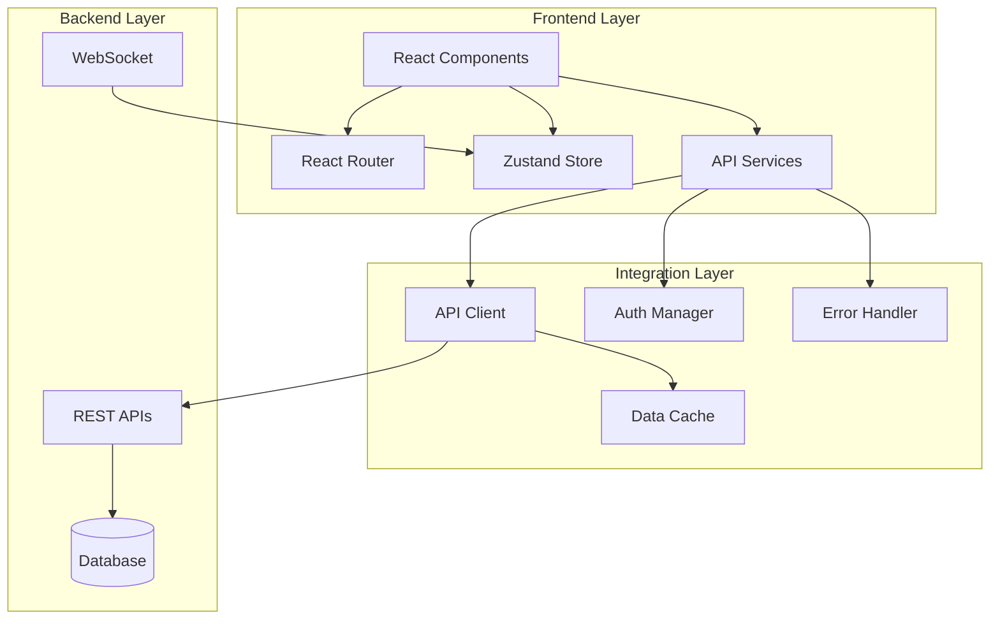
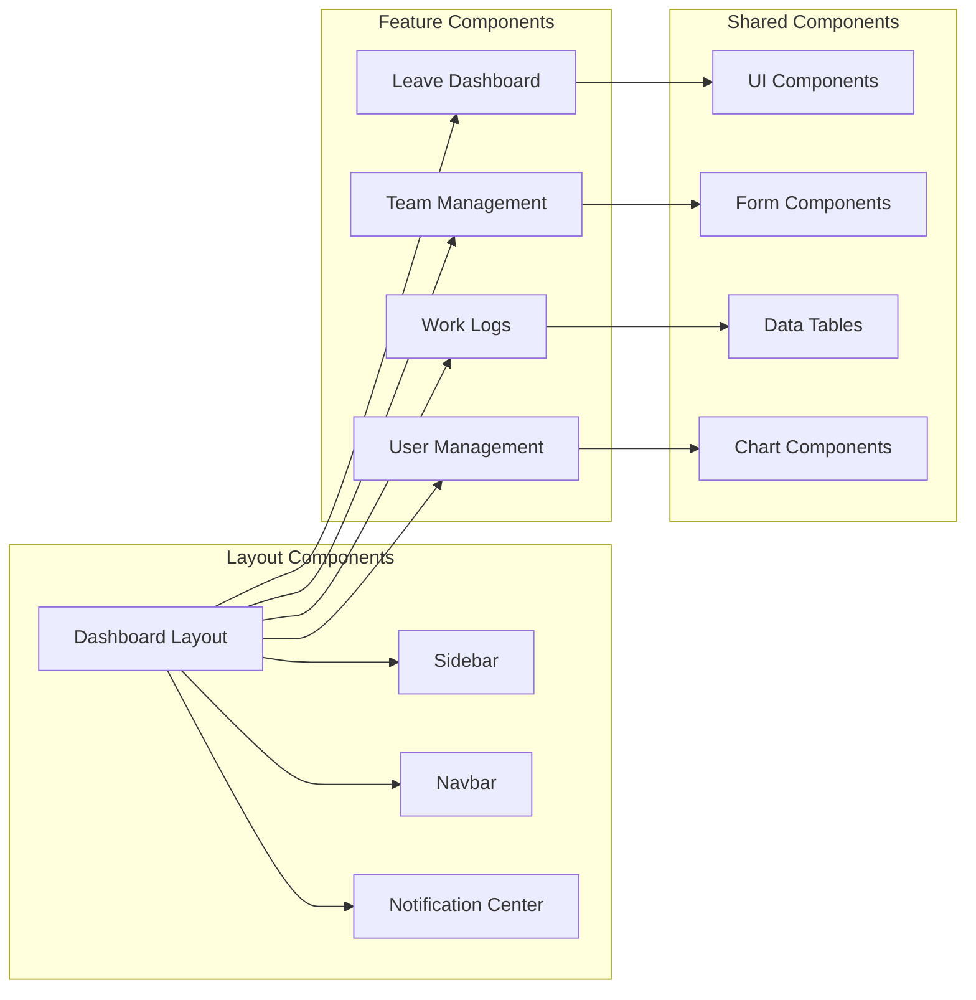

# Design Document

## Overview

The HRMS Frontend Integration system provides a comprehensive React-based user interface with seamless backend connectivity, robust error handling, and role-based access control. The architecture emphasizes maintainability, scalability, and exceptional user experience through modern frontend patterns and practices.

## Architecture

### High-Level Architecture



### Component Architecture



## Components and Interfaces

### Core Service Layer

#### API Client Service
```typescript
interface APIClient {
  get<T>(endpoint: string, config?: RequestConfig): Promise<APIResponse<T>>;
  post<T>(endpoint: string, data: any, config?: RequestConfig): Promise<APIResponse<T>>;
  put<T>(endpoint: string, data: any, config?: RequestConfig): Promise<APIResponse<T>>;
  delete<T>(endpoint: string, config?: RequestConfig): Promise<APIResponse<T>>;
  upload<T>(endpoint: string, file: File, config?: RequestConfig): Promise<APIResponse<T>>;
}

interface APIResponse<T> {
  success: boolean;
  data: T;
  message: string;
  errors?: ValidationError[];
  pagination?: PaginationInfo;
}

interface RequestConfig {
  headers?: Record<string, string>;
  timeout?: number;
  retries?: number;
  cache?: boolean;
}
```

#### Error Handler Service
```typescript
interface ErrorHandler {
  handleAPIError(error: APIError): void;
  handleValidationError(errors: ValidationError[]): void;
  handleNetworkError(error: NetworkError): void;
  showErrorToast(message: string, type: ErrorType): void;
  logError(error: Error, context: ErrorContext): void;
}

interface APIError {
  status: number;
  message: string;
  code: string;
  details?: any;
}

interface ValidationError {
  field: string;
  message: string;
  code: string;
}
```

#### Authentication Manager
```typescript
interface AuthManager {
  login(credentials: LoginCredentials): Promise<AuthResult>;
  logout(): Promise<void>;
  refreshToken(): Promise<string>;
  getCurrentUser(): User | null;
  hasPermission(permission: string): boolean;
  hasRole(role: UserRole): boolean;
}

interface AuthResult {
  user: User;
  token: string;
  refreshToken: string;
  expiresAt: Date;
}
```

### State Management

#### Global Store Structure
```typescript
interface AppStore {
  // Auth State
  auth: {
    user: User | null;
    token: string | null;
    isAuthenticated: boolean;
    permissions: string[];
  };
  
  // UI State
  ui: {
    sidebarOpen: boolean;
    theme: 'light' | 'dark';
    notifications: Notification[];
    loading: Record<string, boolean>;
    errors: Record<string, string>;
  };
  
  // Data State
  data: {
    leaves: LeaveState;
    workLogs: WorkLogState;
    teams: TeamState;
    projects: ProjectState;
    users: UserState;
  };
  
  // Actions
  actions: {
    auth: AuthActions;
    ui: UIActions;
    data: DataActions;
  };
}
```

### Component Interfaces

#### Dashboard Components
```typescript
interface DashboardProps {
  role: UserRole;
  user: User;
}

interface DashboardMetrics {
  totalEmployees?: number;
  pendingLeaves?: number;
  activeProjects?: number;
  todayAttendance?: number;
  monthlyHours?: number;
}

interface QuickAction {
  id: string;
  label: string;
  icon: string;
  action: () => void;
  permission?: string;
}
```

#### Form Components
```typescript
interface FormProps<T> {
  initialValues?: Partial<T>;
  onSubmit: (values: T) => Promise<void>;
  onCancel?: () => void;
  loading?: boolean;
  errors?: Record<string, string>;
  validationSchema?: ValidationSchema<T>;
}

interface FormField {
  name: string;
  label: string;
  type: 'text' | 'email' | 'password' | 'select' | 'date' | 'textarea';
  required?: boolean;
  options?: SelectOption[];
  validation?: FieldValidation;
}
```

#### Data Table Components
```typescript
interface DataTableProps<T> {
  data: T[];
  columns: TableColumn<T>[];
  loading?: boolean;
  pagination?: PaginationConfig;
  sorting?: SortingConfig;
  filtering?: FilterConfig;
  actions?: TableAction<T>[];
  onRowClick?: (row: T) => void;
}

interface TableColumn<T> {
  key: keyof T;
  label: string;
  sortable?: boolean;
  filterable?: boolean;
  render?: (value: any, row: T) => React.ReactNode;
}
```

## Data Models

### User Management Models
```typescript
interface User {
  id: string;
  name: string;
  email: string;
  role: UserRole;
  department?: Department;
  team?: Team;
  manager?: User;
  isActive: boolean;
  createdAt: Date;
  updatedAt: Date;
}

interface Department {
  id: string;
  name: string;
  description?: string;
  manager?: User;
  employees: User[];
  isActive: boolean;
}

interface Team {
  id: string;
  name: string;
  description?: string;
  department: Department;
  manager: User;
  members: User[];
  isActive: boolean;
}
```

### Leave Management Models
```typescript
interface Leave {
  id: string;
  user: User;
  leaveType: LeaveType;
  startDate: Date;
  endDate: Date;
  days: number;
  reason: string;
  status: LeaveStatus;
  appliedAt: Date;
  approver?: User;
  respondedAt?: Date;
  comments?: string;
}

interface LeaveBalance {
  id: string;
  user: User;
  leaveType: LeaveType;
  year: number;
  totalDays: number;
  usedDays: number;
  remainingDays: number;
}

interface LeaveType {
  id: string;
  name: string;
  description?: string;
  defaultDays: number;
  isActive: boolean;
}
```

### Work Log Models
```typescript
interface WorkLog {
  id: string;
  user: User;
  project?: Project;
  task?: Task;
  date: Date;
  hoursWorked: number;
  description: string;
  logType: WorkLogType;
  isApproved: boolean;
  approver?: User;
  comments?: string;
}

interface Project {
  id: string;
  name: string;
  description?: string;
  startDate: Date;
  endDate?: Date;
  status: ProjectStatus;
  manager: User;
  team: Team;
  tasks: Task[];
}

interface Task {
  id: string;
  title: string;
  description?: string;
  project: Project;
  assignee?: User;
  status: TaskStatus;
  priority: TaskPriority;
  dueDate?: Date;
  estimatedHours?: number;
  actualHours?: number;
}
```

## Correctness Properties

*A property is a characteristic or behavior that should hold true across all valid executions of a system-essentially, a formal statement about what the system should do. Properties serve as the bridge between human-readable specifications and machine-verifiable correctness guarantees.*

<function_calls>
<invoke name="prework">
<parameter name="featureName">hrms-frontend-integration
### Prope
rty Reflection

After reviewing all properties identified in the prework, I've identified several areas for consolidation:

**Redundancy Analysis:**
- Properties 1.2 and 1.5 both deal with real-time data updates - can be combined into a comprehensive real-time data property
- Properties 2.1, 2.2, 2.3, 2.4 all relate to API service consistency - can be consolidated into a unified API service property
- Properties 3.1, 3.3, 3.4, 3.5 all handle different aspects of error management - can be combined into comprehensive error handling properties
- Properties 4.1, 4.2, 4.3, 4.4, 4.5 all relate to leave management functionality - can be consolidated into core leave management properties
- Properties 5.1, 5.2, 5.3, 5.4, 5.5 all relate to manager functionality - can be consolidated into manager interface properties
- Properties 6.1, 6.2, 6.3, 6.4, 6.5 all relate to HR admin functionality - can be consolidated into HR admin properties
- Properties 7.1, 7.2, 7.3, 7.4, 7.5 all relate to notification system - can be consolidated into notification properties
- Properties 9.1, 9.2, 9.3, 9.4, 9.5 all relate to data synchronization - can be consolidated into data flow properties
- Properties 10.1, 10.2, 10.3, 10.4, 10.5 all relate to accessibility - can be consolidated into accessibility properties

**Consolidated Properties:**

Property 1: Role-based dashboard consistency
*For any* user with a specific role, the dashboard should display appropriate components, navigation, and data relevant to that role
**Validates: Requirements 1.1**

Property 2: Real-time data synchronization
*For any* data update in the system, all related UI components should reflect changes automatically within performance thresholds without manual refresh
**Validates: Requirements 1.2, 1.5, 9.1, 9.4**

Property 3: Responsive layout adaptation
*For any* screen size change, the UI should adapt layout appropriately for the target device category (desktop, tablet, mobile)
**Validates: Requirements 1.4**

Property 4: API service consistency
*For any* API request, the service layer should provide standardized request/response handling, authentication, data transformation, and optimization
**Validates: Requirements 2.1, 2.2, 2.3, 2.4**

Property 5: Comprehensive error handling
*For any* error condition (API, network, validation, system), the error handler should catch, log, and display appropriate user-friendly messages with recovery options
**Validates: Requirements 3.1, 3.2, 3.3, 3.4, 3.5**

Property 6: Leave management functionality
*For any* leave-related operation (viewing balance, applying, status tracking, calendar display, conflict detection), the system should provide consistent and accurate functionality
**Validates: Requirements 4.1, 4.2, 4.3, 4.4, 4.5**

Property 7: Manager interface completeness
*For any* manager accessing team management features, the system should provide comprehensive tools for approvals, monitoring, and team management with bulk operation support
**Validates: Requirements 5.1, 5.2, 5.3, 5.4, 5.5**

Property 8: HR admin functionality
*For any* HR administrator accessing admin features, the system should provide complete CRUD operations, reporting, configuration, and user management capabilities
**Validates: Requirements 6.1, 6.2, 6.3, 6.4, 6.5**

Property 9: Notification system reliability
*For any* system event requiring notification, the system should display appropriate notifications with proper priority, queuing, syncing, and user preference respect
**Validates: Requirements 7.1, 7.2, 7.3, 7.4, 7.5**

Property 10: State management predictability
*For any* state update operation, the state management system should provide predictable updates with proper data flow and synchronization
**Validates: Requirements 8.2**

Property 11: Route protection and navigation
*For any* navigation attempt, the routing system should enforce role-based protection and provide smooth navigation with deep linking support
**Validates: Requirements 8.3**

Property 12: Data conflict resolution
*For any* data conflict scenario (multiple users, offline changes, validation failures), the system should handle conflicts gracefully with user notification and resolution options
**Validates: Requirements 9.2, 9.3, 9.5**

Property 13: Accessibility compliance
*For any* user interface element, the system should provide full keyboard navigation, screen reader support, display preferences, color alternatives, and clear form guidance
**Validates: Requirements 10.1, 10.2, 10.3, 10.4, 10.5**

## Error Handling

### Error Classification System

```typescript
enum ErrorType {
  NETWORK = 'network',
  API = 'api',
  VALIDATION = 'validation',
  AUTHENTICATION = 'authentication',
  AUTHORIZATION = 'authorization',
  SYSTEM = 'system'
}

enum ErrorSeverity {
  LOW = 'low',
  MEDIUM = 'medium',
  HIGH = 'high',
  CRITICAL = 'critical'
}
```

### Error Handling Strategy

#### Network Errors
- **Detection**: Monitor network connectivity status
- **Fallback**: Show offline indicator, queue operations
- **Recovery**: Auto-retry when connection restored
- **User Feedback**: Clear offline/online status indicators

#### API Errors
- **4xx Errors**: Show user-friendly validation messages
- **5xx Errors**: Show generic error with retry option
- **Timeout**: Show timeout message with retry
- **Rate Limiting**: Show rate limit message with wait time

#### Validation Errors
- **Field-level**: Highlight specific fields with messages
- **Form-level**: Show summary of all validation issues
- **Real-time**: Validate as user types for immediate feedback
- **Accessibility**: Ensure screen reader compatibility

#### Authentication Errors
- **Token Expiry**: Auto-refresh or redirect to login
- **Invalid Credentials**: Clear error messages
- **Session Timeout**: Save work and redirect gracefully
- **Permission Denied**: Show appropriate access denied message

### Error Recovery Mechanisms

```typescript
interface ErrorRecovery {
  retry: () => Promise<void>;
  fallback: () => void;
  report: () => void;
  dismiss: () => void;
}

interface ErrorContext {
  component: string;
  action: string;
  user: User;
  timestamp: Date;
  stackTrace?: string;
  additionalData?: any;
}
```

## Testing Strategy

### Unit Testing Approach

**Component Testing**:
- Test component rendering with different props
- Test user interactions and event handlers
- Test conditional rendering based on state
- Test accessibility features and keyboard navigation
- Mock external dependencies and API calls

**Service Testing**:
- Test API client methods with various responses
- Test error handling for different error types
- Test authentication and token management
- Test data transformation and caching
- Test offline functionality and sync

**State Management Testing**:
- Test state updates and side effects
- Test action creators and reducers
- Test selectors and computed values
- Test persistence and hydration
- Test concurrent updates and race conditions

### Property-Based Testing Approach

**Testing Framework**: fast-check (JavaScript property-based testing library)
**Test Configuration**: Minimum 100 iterations per property test
**Generator Strategy**: Create smart generators that produce realistic test data within valid input domains

**Property Test Categories**:

1. **UI Consistency Properties**: Test that UI components behave consistently across different data inputs and user roles
2. **API Integration Properties**: Test that API services handle all response types correctly and maintain consistent behavior
3. **Error Handling Properties**: Test that error handlers properly catch and handle all error types with appropriate user feedback
4. **Data Synchronization Properties**: Test that data updates propagate correctly across all components and maintain consistency
5. **Accessibility Properties**: Test that accessibility features work consistently across all components and user interactions

**Property Test Implementation Requirements**:
- Each property-based test must be tagged with a comment referencing the design document property
- Use format: `**Feature: hrms-frontend-integration, Property {number}: {property_text}**`
- Configure each test to run minimum 100 iterations
- Create realistic data generators for Users, Leaves, Projects, Teams, etc.
- Test edge cases through generator configuration rather than separate tests

### Integration Testing Strategy

**API Integration Tests**:
- Test complete request/response cycles
- Test authentication flows and token refresh
- Test error scenarios and recovery
- Test real-time updates via WebSocket
- Test offline/online synchronization

**End-to-End Testing**:
- Test complete user workflows for each role
- Test cross-component data flow
- Test navigation and routing
- Test form submissions and validations
- Test notification delivery and interaction

**Performance Testing**:
- Test dashboard load times under various data loads
- Test real-time update performance with multiple users
- Test memory usage during extended sessions
- Test network efficiency and caching effectiveness
- Test mobile performance on various devices

### Testing Tools and Configuration

```typescript
// Jest Configuration
export default {
  testEnvironment: 'jsdom',
  setupFilesAfterEnv: ['<rootDir>/src/test/setup.ts'],
  moduleNameMapping: {
    '^@/(.*)$': '<rootDir>/src/$1'
  },
  collectCoverageFrom: [
    'src/**/*.{ts,tsx}',
    '!src/**/*.d.ts',
    '!src/test/**/*'
  ],
  coverageThreshold: {
    global: {
      branches: 80,
      functions: 80,
      lines: 80,
      statements: 80
    }
  }
};

// Property Testing Configuration
const propertyTestConfig = {
  numRuns: 100,
  timeout: 5000,
  seed: 42,
  path: ['src', 'components', 'services'],
  verbose: true
};
```