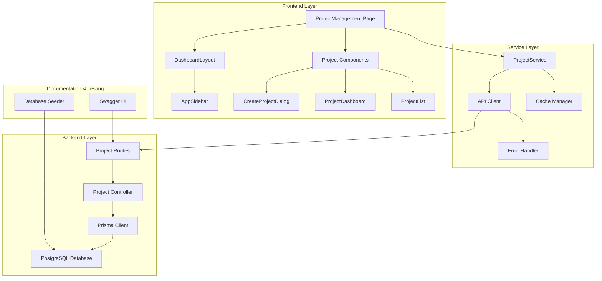

# Design Document

## Overview

This design addresses the critical integration issues in the project management module by implementing a comprehensive solution that connects the frontend React components with the backend Node.js/Express APIs, ensures proper layout structure with sidebar navigation, provides complete Swagger documentation, and includes database seeding for realistic testing data.

The solution follows a layered architecture approach with clear separation between presentation, service, and data layers while maintaining role-based security throughout.

## Architecture

### System Architecture



### Component Architecture

The frontend follows a hierarchical component structure:

1. **Layout Level**: DashboardLayout provides consistent structure
2. **Page Level**: ProjectManagement orchestrates all project functionality  
3. **Feature Level**: Specialized components for specific project operations
4. **UI Level**: Reusable UI components and forms

### API Architecture

The backend implements RESTful APIs with the following structure:

- **Route Layer**: Defines endpoints and middleware
- **Controller Layer**: Handles business logic and validation
- **Service Layer**: Database operations through Prisma
- **Middleware Layer**: Authentication, validation, and error handling

## Components and Interfaces

### Frontend Components

#### 1. Enhanced ProjectManagement Page
```typescript
interface ProjectManagementProps {
  // No props - uses layout and routing context
}

interface ProjectManagementState {
  activeTab: 'dashboard' | 'projects' | 'timeline' | 'resources';
  searchQuery: string;
  statusFilter: ProjectStatus | 'all';
  priorityFilter: ProjectPriority | 'all';
  selectedProject: Project | null;
  showCreateDialog: boolean;
}
```

**Key Changes:**
- Wrap in DashboardLayout for sidebar navigation
- Fix API service integration
- Implement proper error handling
- Add loading states and optimistic updates

#### 2. Fixed CreateProjectDialog
```typescript
interface CreateProjectDialogProps {
  open: boolean;
  onOpenChange: (open: boolean) => void;
  onProjectCreated: (project: Project) => void;
}

interface CreateProjectFormData {
  name: string;
  description?: string;
  startDate: Date;
  endDate?: Date;
  priority: ProjectPriority;
  teamId: string;
  managerId: string;
}
```

**Key Changes:**
- Fix API endpoint calls to match backend
- Implement proper validation
- Add error handling and user feedback
- Ensure form data matches backend expectations

#### 3. Updated ProjectService
```typescript
class ProjectService extends BaseService {
  // Fixed API endpoints to match backend routes
  async getProjects(): Promise<ServiceResponse<Project[]>>;
  async getMyProjects(): Promise<ServiceResponse<Project[]>>;
  async getProjectDashboard(): Promise<ServiceResponse<DashboardData>>;
  async createProject(data: CreateProjectData): Promise<ServiceResponse<Project>>;
  async updateProject(id: string, data: UpdateProjectData): Promise<ServiceResponse<Project>>;
  async getProjectById(id: string): Promise<ServiceResponse<Project>>;
}
```

### Backend Controllers

#### 1. Enhanced Project Controller
```typescript
// New endpoints to match frontend expectations
export const getProjects = async (req: Request, res: Response, next: NextFunction);
export const getMyProjects = async (req: Request, res: Response, next: NextFunction);
export const getProjectDashboard = async (req: Request, res: Response, next: NextFunction);
export const getProjectTasks = async (req: Request, res: Response, next: NextFunction);
export const getProjectMetrics = async (req: Request, res: Response, next: NextFunction);
```

#### 2. Updated Route Definitions
```typescript
// GET /api/projects - Get all projects (role-based filtering)
// GET /api/projects/my-projects - Get user's assigned projects  
// GET /api/projects/dashboard - Get dashboard statistics
// GET /api/projects/:id - Get project details
// GET /api/projects/:id/tasks - Get project tasks
// GET /api/projects/:id/metrics - Get project metrics
// POST /api/projects - Create new project
// PUT /api/projects/:id - Update project
// DELETE /api/projects/:id - Delete project (soft delete)
```

## Data Models

### Enhanced Project Model
```typescript
interface Project {
  id: string;
  name: string;
  description?: string;
  startDate: string;
  endDate?: string;
  status: 'PLANNING' | 'ACTIVE' | 'ON_HOLD' | 'COMPLETED' | 'CANCELLED';
  priority: 'LOW' | 'MEDIUM' | 'HIGH' | 'CRITICAL';
  progress: number; // 0-100
  isActive: boolean;
  createdAt: string;
  updatedAt: string;
  
  // Relationships
  manager: {
    id: string;
    name: string;
    email: string;
  };
  team: {
    id: string;
    name: string;
    memberCount: number;
  };
  tasks: ProjectTask[];
  
  // Computed fields
  _count: {
    tasks: number;
    completedTasks: number;
  };
}
```

### Dashboard Data Model
```typescript
interface ProjectDashboardData {
  totalProjects: number;
  activeProjects: number;
  completedProjects: number;
  overdueProjects: number;
  
  projectsByStatus: Array<{
    status: string;
    count: number;
  }>;
  
  projectsByPriority: Array<{
    priority: string;
    count: number;
  }>;
  
  recentProjects: Project[];
  
  upcomingDeadlines: Array<{
    projectId: string;
    projectName: string;
    deadline: string;
    daysRemaining: number;
  }>;
  
  teamWorkload: Array<{
    teamId: string;
    teamName: string;
    activeProjects: number;
    totalTasks: number;
    completedTasks: number;
  }>;
}
```

## Error Handling

### Frontend Error Handling
```typescript
interface APIError {
  success: false;
  message: string;
  errors?: ValidationError[];
  code?: string;
}

// Error handling strategy:
// 1. Network errors - Show retry option
// 2. Validation errors - Show field-specific messages  
// 3. Authorization errors - Redirect to login
// 4. Server errors - Show generic error message
// 5. Optimistic update failures - Rollback UI state
```

### Backend Error Handling
```typescript
// Standardized error responses
interface ErrorResponse {
  success: false;
  message: string;
  errors?: Array<{
    field: string;
    message: string;
  }>;
  code: string;
}

// Error types:
// - ValidationException (400)
// - UnauthorizedException (401) 
// - NotFoundException (404)
// - InternalException (500)
```

## Testing Strategy

### Database Seeding Strategy

#### 1. Company and Department Setup
```typescript
// Create sample companies with departments
const seedCompanies = async () => {
  const companies = [
    {
      name: "TechCorp Solutions",
      departments: ["Engineering", "Product", "Marketing", "HR"]
    },
    {
      name: "InnovateLabs", 
      departments: ["Development", "Design", "Operations", "Sales"]
    }
  ];
};
```

#### 2. User Role Distribution
```typescript
// Create users with realistic role distribution
const seedUsers = async () => {
  const roles = {
    ADMIN: 1,      // 1 admin per company
    HR: 2,         // 2 HR users per company  
    MANAGER: 5,    // 5 managers per company
    EMPLOYEE: 20   // 20 employees per company
  };
};
```

#### 3. Project and Task Relationships
```typescript
// Create projects with proper relationships
const seedProjects = async () => {
  // Each manager gets 2-4 projects
  // Each project has 1 team assigned
  // Each project has 5-15 tasks
  // Tasks are assigned to team members
  // Projects have realistic timelines and priorities
};
```

### API Testing Framework

#### 1. Swagger Documentation Structure
```yaml
# Project Management API Documentation
/api/projects:
  get:
    summary: Get all projects
    parameters:
      - name: status
        in: query
        schema:
          type: string
          enum: [PLANNING, ACTIVE, ON_HOLD, COMPLETED, CANCELLED]
      - name: priority  
        in: query
        schema:
          type: string
          enum: [LOW, MEDIUM, HIGH, CRITICAL]
    responses:
      200:
        description: Projects retrieved successfully
        content:
          application/json:
            schema:
              type: object
              properties:
                success:
                  type: boolean
                message:
                  type: string
                projects:
                  type: array
                  items:
                    $ref: '#/components/schemas/Project'
```

#### 2. Test Data Examples
```typescript
// Swagger examples for testing
const swaggerExamples = {
  createProject: {
    name: "Mobile App Redesign",
    description: "Complete redesign of the mobile application UI/UX",
    startDate: "2024-01-15T00:00:00.000Z",
    endDate: "2024-04-15T00:00:00.000Z", 
    priority: "HIGH",
    teamId: "team-uuid-here",
    managerId: "manager-uuid-here"
  },
  
  projectResponse: {
    success: true,
    message: "Project created successfully",
    project: {
      id: "project-uuid-here",
      name: "Mobile App Redesign",
      status: "PLANNING",
      progress: 0,
      manager: {
        id: "manager-uuid-here",
        name: "John Smith",
        email: "john.smith@company.com"
      },
      team: {
        id: "team-uuid-here", 
        name: "Mobile Development Team",
        memberCount: 6
      }
    }
  }
};
```

### Integration Testing

#### 1. Frontend-Backend Integration Tests
```typescript
// Test complete user workflows
describe('Project Management Integration', () => {
  test('Manager can create project through UI', async () => {
    // 1. Login as manager
    // 2. Navigate to project management
    // 3. Open create project dialog
    // 4. Fill form with valid data
    // 5. Submit form
    // 6. Verify project appears in list
    // 7. Verify database contains project
  });
  
  test('Project dashboard shows correct metrics', async () => {
    // 1. Seed database with known project data
    // 2. Login and navigate to dashboard
    // 3. Verify metrics match expected values
    // 4. Verify charts display correct data
  });
});
```

#### 2. API Endpoint Tests
```typescript
// Test all API endpoints with various scenarios
describe('Project API Endpoints', () => {
  test('GET /api/projects returns role-filtered results', async () => {
    // Test with different user roles
    // Verify each role sees appropriate projects
  });
  
  test('POST /api/projects validates required fields', async () => {
    // Test with missing/invalid data
    // Verify proper error responses
  });
});
```

## Implementation Phases

### Phase 1: Backend API Completion (Priority: High)
1. Add missing controller methods
2. Update route definitions  
3. Implement proper validation
4. Add role-based filtering
5. Test all endpoints

### Phase 2: Frontend Integration Fix (Priority: High)  
1. Fix ProjectService API calls
2. Update component error handling
3. Implement DashboardLayout wrapper
4. Fix data flow and state management
5. Test UI functionality

### Phase 3: Documentation and Testing (Priority: Medium)
1. Update Swagger documentation
2. Create comprehensive API examples
3. Implement database seeding
4. Create integration tests
5. Validate end-to-end workflows

### Phase 4: Performance and Polish (Priority: Low)
1. Implement caching strategies
2. Add loading states and animations
3. Optimize database queries
4. Add advanced filtering options
5. Implement real-time updates

## Correctness Properties

*A property is a characteristic or behavior that should hold true across all valid executions of a system-essentially, a formal statement about what the system should do. Properties serve as the bridge between human-readable specifications and machine-verifiable correctness guarantees.*

### Property 1: Project Creation Round Trip
*For any* valid project data submitted through the CreateProjectDialog, the project should be successfully saved to the database and retrievable with all original data intact
**Validates: Requirements 1.1**

### Property 2: API Integration Consistency  
*For any* project service API call, the HTTP method and endpoint path should match the corresponding backend route definition
**Validates: Requirements 1.2, 6.1**

### Property 3: Real Data Display
*For any* project data loaded from the database, the UI should display the actual database values rather than hardcoded mock data
**Validates: Requirements 1.3**

### Property 4: Comprehensive Error Handling
*For any* API failure scenario (network, validation, authorization, server error), the system should display appropriate user-friendly error messages and handle the failure gracefully
**Validates: Requirements 1.4, 6.2**

### Property 5: UI State Synchronization
*For any* successful project operation (create, update, delete), the UI should immediately reflect the changes with fresh data from the server
**Validates: Requirements 1.5**

### Property 6: Role-Based Menu Display
*For any* user role (ADMIN, HR, MANAGER, EMPLOYEE), the sidebar should display only the menu items appropriate for that role's permissions
**Validates: Requirements 2.2**

### Property 7: Layout Navigation Consistency
*For any* sidebar navigation action, the dashboard layout structure should remain consistent and properly positioned
**Validates: Requirements 2.3**

### Property 8: Responsive Sidebar Behavior
*For any* sidebar collapse/expand action, the content area should adjust its width and positioning appropriately
**Validates: Requirements 2.5**

### Property 9: API Endpoint Completeness
*For any* required project management operation (get all, get mine, get dashboard, create, update, get tasks), a corresponding API endpoint should exist and respond correctly
**Validates: Requirements 3.1, 3.2, 3.3, 3.5, 3.6**

### Property 10: API Validation Enforcement
*For any* project creation or update request with invalid data, the API should reject the request with appropriate validation error messages
**Validates: Requirements 3.4**

### Property 11: Swagger Documentation Completeness
*For any* project management API endpoint, the Swagger documentation should include complete schemas, examples, and security requirements
**Validates: Requirements 4.1, 4.2, 4.4, 4.5**

### Property 12: Swagger Example Functionality
*For any* API example provided in Swagger documentation, executing the example should result in a successful API response
**Validates: Requirements 4.3**

### Property 13: Database Seeding Completeness
*For any* seeding operation, the database should be populated with realistic companies, departments, users with proper roles, projects with valid team assignments, and tasks with proper member assignments
**Validates: Requirements 5.1, 5.2, 5.3, 5.4**

### Property 14: Seeded Data Functionality
*For any* project management feature, the feature should work correctly when using seeded database data
**Validates: Requirements 5.5**

### Property 15: Cache Invalidation Consistency
*For any* data modification operation, related caches should be invalidated to ensure fresh data is loaded on subsequent requests
**Validates: Requirements 6.3**

### Property 16: Optimistic Update Rollback
*For any* optimistic UI update that fails due to API errors, the UI state should rollback to the previous state
**Validates: Requirements 6.4**

### Property 17: Real-time Data Synchronization
*For any* project data change, all connected clients should receive and display the updated data
**Validates: Requirements 6.5**

### Property 18: Role-Based Access Control
*For any* user with a specific role (ADMIN, HR, MANAGER, EMPLOYEE), they should only be able to access and modify projects according to their role's permissions
**Validates: Requirements 7.1, 7.2, 7.3, 7.4**

### Property 19: Unauthorized Access Protection
*For any* attempt to access projects without proper authorization, the system should return appropriate error responses and deny access
**Validates: Requirements 7.5**

### Property 20: Input Validation Completeness
*For any* project creation or update operation, all required fields should be validated for presence and correct data types
**Validates: Requirements 8.1**

### Property 21: Data Integrity Preservation
*For any* project update operation, existing data relationships (team assignments, manager assignments, task assignments) should remain valid and consistent
**Validates: Requirements 8.2**

### Property 22: Testing Framework Completeness
*For any* project management scenario (success cases, error cases, edge cases), the testing framework should provide comprehensive test coverage through Swagger examples and seeded data
**Validates: Requirements 8.3, 8.4**

### Property 23: Permission Enforcement Consistency
*For any* user role and project operation combination, the system should consistently enforce the same access restrictions across all interfaces (UI, API, database)
**Validates: Requirements 8.5**